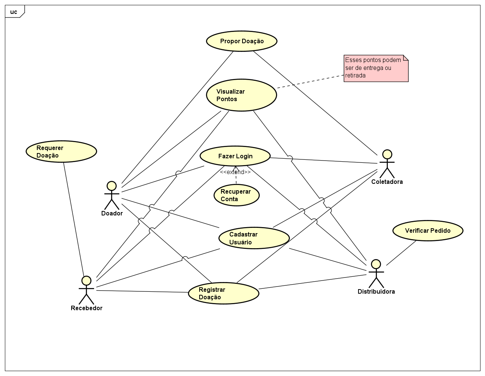
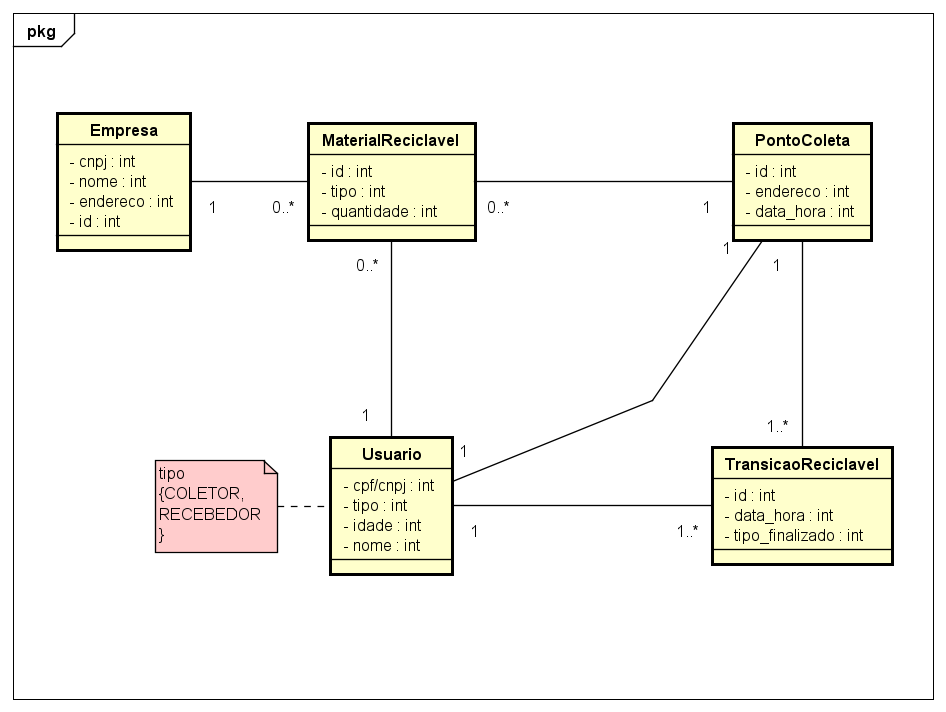

# ♻ Reciclagem Solidária

Documentação do projeto desenvolvido como atividade da disciplina de Análise e Projeto Orientada a Objetos, no Curso Técnico Integrado em Informática para Internet – IFRN
Campus Natal-Central.

## Objetivo do Produto
Evitar o descarte incorreto de produtos não biodegradáveis e reaproveitar seu material para produzir outros produtos para que possam ser reutilizados por pessoas ou comunidades/instituições carentes.

## Público-Alvo
Pessoas que querem ser mais sustentáveis e ajudar pessoas carentes, além de empresas que já trabalham no ramo de reciclagem e distribuição.

## Principais Funcionalidades
- RF001 - Cadastro de Usuários 
Permitir o cadastro de doadores, empresas recicladoras e instituições. 
- RF002 - Login de Usuários 
Permitir o acesso ao sistema por meio de autenticação. 
- RF003 - Cadastro de Itens para Doação 
Permitir que doadores cadastrem itens, escolhendo a categoria (ex: roupas,  móveis, etc.). 
- RF004 - Visualização de Pontos de Coleta 
Exibir locais de coleta com endereço e horário. 
- RF005 - Solicitação de Doações 
Permitir que pessoas/instituições preencham formulário para receber doações. 
- RF006 - Contador de Doações 
Mostrar o número total de doações realizadas na plataforma. 
- RF007 - Perfil de Empresas Recicladoras 
Permitir que empresas publiquem seus serviços e mostrem seus trabalhos. 
- RF008 - Notificações 
Enviar alertas sobre status de doações, solicitações e atualizações. 

## Restrições e Premissas
- O sistema será desenvolvido para acesso via web;  
- Necessidade de acesso à internet para utilizar as funcionalidades; 
- Usuários terão acesso a dispositivos com conexão estável à internet; 
- Empresas participantes já possuem cadastro prévio e autorização para atuar no ramo;
- Pontos de coleta já estarão definidos e devidamente sinalizados.

 ---

# Casos de Uso

1. Propor doação de Produto
2. Registrar doação de produto(s)
3. Visualizar pontos de entrega/retirada de produtos

Para mais detalhes, acesse [casos-de-uso.md](casos-de-uso.md).
---

# Modelo Conceitual
- O modelo conceitual representa as classes de análise do sistema, com seus principais atributos e relacionamentos.

As descrições das classes estão disponíveis no arquivo [modelo-conceitual.md](modelo-conceitual.md).
---

# Tecnologias Utilizadas
- Documentação escrita em Markdown
- Diagramas elaborados com o Astah
- Repositório hospedado no GitHub
---

# Equipe
 Integrante | Matrícula |
 ---------- | --------- |
 Kaylane Yanomani | 20231011110008 |
 Ludmylla da Silva | 20241011110027 |
 Maria Júlia | 20241011110018 |
 Ricardo Xavier | 20241011110001 |